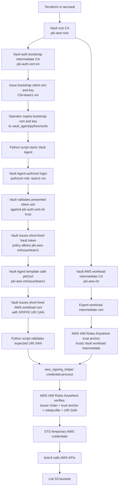

# Python Certificate Auth Flow

This diagram shows the end-to-end flow for the Python example:

- how the bootstrap client certificate is created
- how the Python workload authenticates to Vault with that certificate
- how Vault issues the AWS workload certificate
- how AWS IAM Roles Anywhere returns temporary credentials

## Sequence Summary

1. Terraform creates two separate trust chains in Vault:
   - `pki-auth-cert-int` for Vault `auth/cert` bootstrap login
   - `pki-aws-int` for AWS workload certificates
2. Terraform issues the bootstrap `team1-vm` client certificate from `pki-auth-cert-int`.
3. That bootstrap cert and key are copied into the Python example's `certs` directory.
4. Vault Agent presents the bootstrap cert to `auth/cert/login`.
5. Vault returns a Vault token scoped to issuing certificates from `pki-aws-int/issue/team1`.
6. Vault Agent uses that token to render a new short-lived workload certificate for AWS.
7. `aws_signing_helper` exchanges the workload certificate for temporary AWS credentials through IAM Roles Anywhere.
8. `boto3` uses those temporary credentials to access AWS resources.

## Trust Separation

- `pki-auth-cert-int` is only for authenticating the workload to Vault.
- `pki-aws-int` is only for authenticating the workload to AWS IAM Roles Anywhere.
- Keeping those intermediates separate avoids mixing Vault login trust with AWS workload trust.
